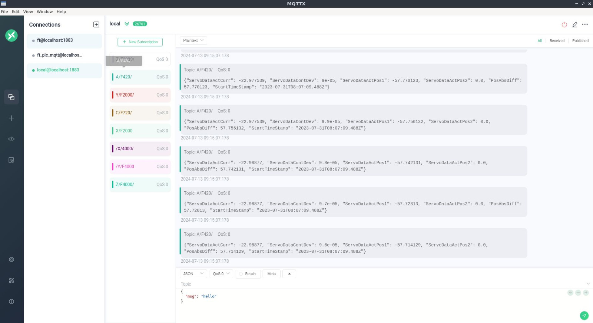
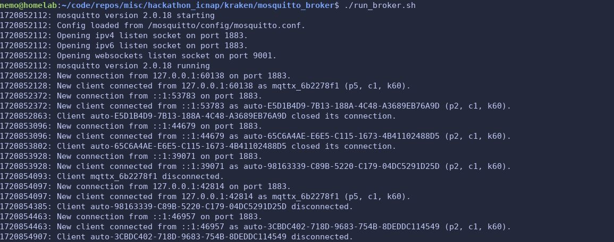

# Central Data Integration Platform

## Overview

This project is a central platform that integrates different data sources and protocols (TCP/IP, Modbus, MQTT, OPC UA), stores and interprets the data efficiently using TimescaleDB, and ensures reproducibility by leveraging Docker containers.

## Architecture

1. **Data Acquisition Layer**: Utilizes a multiprotocol microcontroller to gather data using TCP/IP, Modbus, MQTT, and OPC UA protocols.
2. **Data Ingestion Layer**: Implements Docker containers to handle data ingestion, ensuring each protocol has a dedicated container for modularity and reproducibility.
3. **Data Storage Layer**: Uses TimescaleDB to store the collected data efficiently.
4. **Data Processing and Interpretation Layer**: Uses a data processing framework to interpret and analyze the data.
5. **User Interface Layer**: Develops a user-friendly interface to visualize the data and control the system.

## Technologies

- **Microcontroller**: ESP32 or Raspberry Pi with support for multiple protocols.
- **Docker**: For containerization.
- **Database**: TimescaleDB.
- **Data Processing**: Python with libraries like Pandas and NumPy.
- **UI**: Flask for backend API and React for frontend.

## Visualisation Intermediates





### Prerequisites

- Docker and Docker Compose installed on your machine.

### Steps

1. **Clone the repository**:

   ```bash
   git clone <repository-url>
   cd <repository-directory>

   
